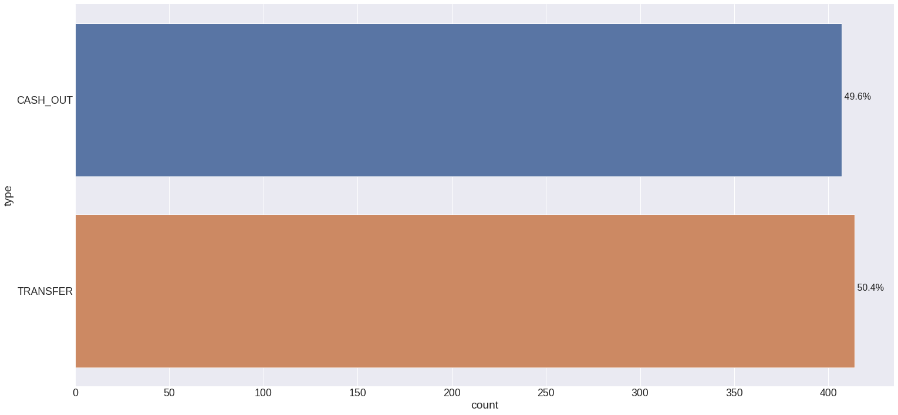

# Transaction Fraud Detection

## 1.0 Business Problem

The Blocker Fraud Company is a company specialized in detecting fraud in financial transactions made through mobile devices. The company has a service called "Blocker Fraud" which guarantees the blocking of fraudulent transactions.

The business model of the company is of the Service type with the monetization made by the performance of the service provided, in other words, the user pays a fixed fee on the success in detecting fraud in the customer's transactions.

However, the Blocker Fraud Company is expanding in Brazil and to acquire customers more quickly, it has adopted a very aggressive strategy. The strategy works as follows:

1. The company will receive 25% of the value of each transaction truly detected as fraud;

1. The company will receive 5% of the value of each transaction detected as fraud, but the transaction is truly legitimate.

1. The company will return 100% of the value to the customer, for each transaction detected as legitimate, however the transaction is truly a fraud.

With this aggressive strategy, the company assumes the risks of failing to detect fraud and is remunerated for assertive fraud detection.

For the client, it is an excellent business to hire the Blocker Fraud Company. Although the fee charged is very high on success, 25%, the company reduces its costs with fraudulent transactions detected correctly and even the damage caused by an error in the anti-fraud service will be covered by the Blocker Fraud Company itself.

For the company, in addition to getting many customers with this risky strategy to guarantee reimbursement in the event of a failure to detect customer fraud, it depends only on the precision and accuracy of the models built by its Data Scientists, in other words, how much the more accurate the “Blocker Fraud” model, the greater the company's revenue. However, if the model has low accuracy, the company could have a huge loss.

## 2.0 Business Assumptions

Fraud prevention is the implementation of a strategy to detect fraudulent transactions or banking actions and prevent these actions from causing financial damage and the reputation of the client and the financial institution.

There are always financial frauds and They can happen through virtual and physical ways. So the investment in security has been increasing.

The losses caused by fraud can reach R\$ 1 billion - which corresponds to half the amount that institutions invest in technology systems aimed at information security every year, according to [Febraban's 2020 Banking Technology Survey](https://blog.simply.com.br/tecnologia-bancaria-2020/).

## 3.0 Solution Strategy

My solution to solve this problem will be the development of a data science project. This project will have a machine learning model which can predict whether a transaction is fraudulent or not.

**Step 01. Data Description:** In this first section the data will be collected and studied. The missing values will be threated or removed. Finally, a initial data description will carried out to know the data. Therefore some calculations of descriptive statistics will be made, such as kurtosis, skewness, media, fashion, median and standard desviation.

**Step 02. Feature Engineering:** In this section, a mind map will be created to assist the creation of the hypothesis and the creation of new features. These assumptions will help in exploratory data analysis and may improve the model scores.

**Step 03. Data Filtering:** Data filtering is used to remove columns or rows that are not part of the business. For example, columns with customer ID, hash code or rows with age that does not consist of human age.

**Step 04. Exploratory Data Analysis:** The exploratory data analysis section consists of univariate analysis, bivariate analysis and multivariate analysis to assist in understanding of the database. The hypothesis created in step 02 will be tested in the bivariate analysis.

**Step 05. Data Preparation:** In this fifth section, the data will be prepared for machine learning modeling. Therefore, they will be transformed to improve the learning of the machine learning model, thus they can be encoded, oversampled, subsampled or rescaled.

**Step 06. Feature Selection:** After the data preparation in this section algorithms, like Boruta, will select the best columns to be used for the training of the machine learning model. This reduces the dimensionality of the database and decreases the chances of overfiting.

**Step 07. Machine Learning Modeling:** Step 07 aims to train the machine learning algorithms and how they can predict the data. For validation the model is trained, validated and applied to cross validation to know the learning capacity of the model.

**Step 08. Hyparameter Fine Tuning:** Firstly selected the best model to be applied in the project, it's important to make a fine tuning of the parameters to improve its scores. The same model performance methods apllied in the step 07 are used.

**Step 09. Conclusions:** This is a conclusion stage which the generation capacity model is tested using unseen data. In addition, some business questions are answered to show the applicability of the model in the business context.

**Step 10. Model Deploy:** This is the final step of the data science project. So, in this step the flask api is created and the model and the functions are saved to be implemented in the api.

## 4.0 Top 3 Data Insights

* #### All the fraud amount is greater than 10.000.

    **TRUE:** The values are greater than 10.000. But it's important to note that the no-fraud values is greater than 100.000 also.

    

* #### 60% of fraud transaction occours using cash-out-type method.

    **FALSE:** The fraud transaction occours in transfer and cash-out type. However they're almost the same value.

    

* #### Values greater than 100.000 occours using transfers-type method.

    **FALSE:** The majority transactions occours in trasnfer-type, however transactions greater than 100.000 occour in cash-out and cash-in too.

    

